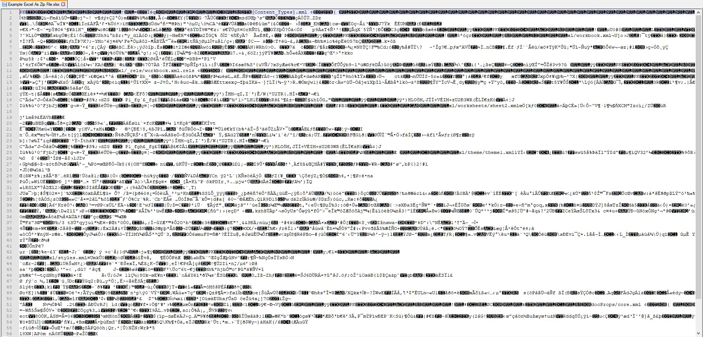
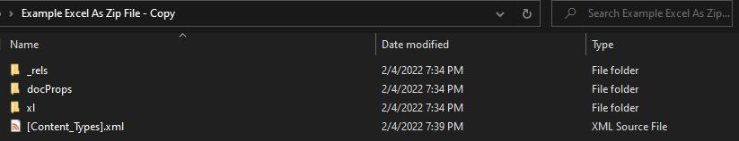

# Under the Hood: Excel Files as Zip Folders

Dealing with the plumbing in Excel is like dealing with any other problem in plumbing: you don't think about it until something is leaking and stinking up the place, and then it's the only thing you can think about. I'm going to show you a bit of how Excel spreadsheets (but also Word and PPT files as well) are constructed so that you can work with them in some unsanitary ways when you have no other option.

## Markup Language for Office

If you've ever tried to open an Excel file with a note editor (Notepad, Notepad++, etc.) you'll notice that you don't get much of anything legible.

This is because when Excel saves your document, there's no clean way to represent a spreadsheet as a single text document: the relationships and features are too complex. Instead, you need to bring together a larger package of information, each one its own discrete text file, but combined into a greater picture.

The way Microsoft chose to tackle this problem was to use XML, or _eXtensible Markup Language_. Similar to how HyperText Markup Language (HTML) is the underlying language of a website, XML offers a way to organize content in a consistent, simple manner with different files handling different distinct elements of a workbook.

This means that a single Excel file isn't actually a file: it's a folder (specifically a Zip folder) of all of these various XML and other files that define what its components

## Taking a Look

There is far too much detail to go into here, but I'll point out a few of the key elements to keep track of.

### Overall Navigation

Take a look for yourself in the folder structure, but the bulk of what you're looking for is within the 'xl' folder: that contains the various sheet objects, styling guides, and all the other components that make up the workbook. These will be bound together in the relationship files, which define how these pieces fit together. Opening the 'workbook.xml.rels' file should show you most of the components operate.

### Fragility of the System

It's very easy to break these files by editing small elements of the underlying XML. If you do feel like tinkering, I recommend you make a copy of the Excel file, then change the file extension from ".xlsx" to ".zip" and extract the files. You can reverse that process, but depending on what you edit, the file may not work as expected when you do.

### Shared Strings

If you type a string value into a cell, it's not actually stored 'in' the cell, so to speak. Instead, the Excel document has an XML sheet that acts as a database of all the unique strings in the file, and the the cell has a reference to whichever unique string it needs. This allows you to save space in the (likely) scenario that you are repeating content across multiple cells or sheets, but it makes tracking down values complicated.

### Calculations and Chains

The calculation chain for Excel is a large topic in the way that it is managed[^1]: at its core, Excel is a calculation engine. It's what is so hard to reproduce and why Microsoft has made so much money from the software. A key component of that calculation engine is the calculation chain, which is the ordered list of cells to calculate. it ignores cells with entered values (e.g. 2) and instead determines which formulas must be calculated first if there are any dependencies. This is what allows the Excel engine to detect circular references, and hopefully, optimize the chain.

## When Does This Come Up?

With any luck, you should never have to dive in and modify this garbage by hand. In the same way that you never need to write HTML to visit and use a website, you should never have to jump into XML in the normal day to day of any kind of Microsoft Office work. That being said, here are a few times where it may come up:

-   **Borked files**
    -   Excel has a built in repair functionality that should work, but if it's not and you need to go extract a specific value, then XML may be the way to go
-   **Hidden content**
    -   VBA projects are not rendered as XML files: instead, they're stored as binaries, and Microsoft has made it very hard to crack those open, for good reason. For starters, there are professional tools built in VBA that Microsoft doesn't want to make easy to decompile. As well, A significant number of computer viruses are VBA based, and binary packages are treated differently, allowing them to be sequestered, so that you can consume a workbook without activating any underlying code.
-   **Programmatically creating Office documents**
    -   While there are some Python libraries that can edit Excel files, they come with significant trade offs of efficiency and capability. Microsoft's own Open XML SDK[^2] is the best way to edit these files at the native level, though it there is a significant learning curve to the system.

[^1]: Further reading on the <a href='https://docs.microsoft.com/en-us/office/client-developer/excel/excel-recalculation' target='_blank'>Calculation Chain</a> available here
[^2]: The <a href='https://docs.microsoft.com/en-us/office/open-xml/open-xml-sdk' target='_blank'>Open XML SDK</a> is a .NET library for programmatically editing Excel files
