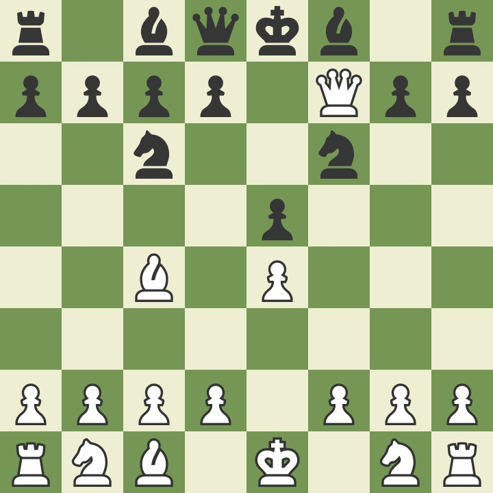
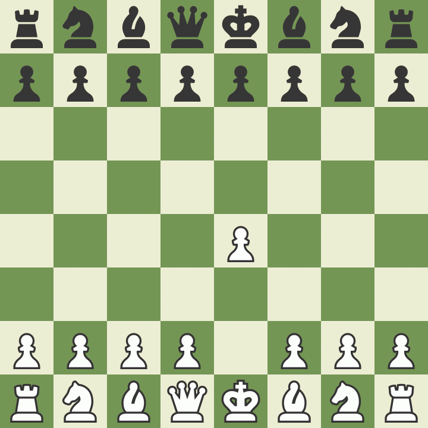

# Scholar's Mate: The Gut Punch

The Scholar's Mate[^1] is one of the first 'trick mate' patterns a novice player learns in chess. Relying on the the long distance attacks of the Queen and Bishop against the weak f pawn, the Scholar's Mate is one of the fastest checkmate sequences that can happen in a game.

Here is how the the Scholar's Mate looks when the dust has settled:

While there are a few different ways a Scholar's Mate can be set up, here are the moves (and a brief GIF) of the mate:

    1. e4 e5
    2. Qh5 Nc6
    3. Bc4 Nf6??
    4. Qxf7#

## How To Spot It

The core idea of the Scholar's Mate is setting both the Queen and the Bishop on the weak f7 square: in the starting position, only the King defends this square, so any protected attacker is a serious threat.

Black's moves to develop the e-file pawn and their two Knights is not itself a bad idea, but their moves do nothing to protect the f7 square, while White develops two separate pieces to attack. The moves 3...g6, 3...Qe7, or 3...Qf6 are all acceptable ways to block the attack, defend the square, or both.

This can be harder for newer players to spot because it relies on the long attack of white's light-square Bishop. That being said, if you can keep your eyes on both your and your opponents Bishops, you can exploit opportunities for this. But just remember, the f pawn is weak, both for you and your opponent.

[^1]: <a href='https://en.wikipedia.org/wiki/Scholar%27s_mate' target='_blank'>Scholar's Mate</a> history and details
