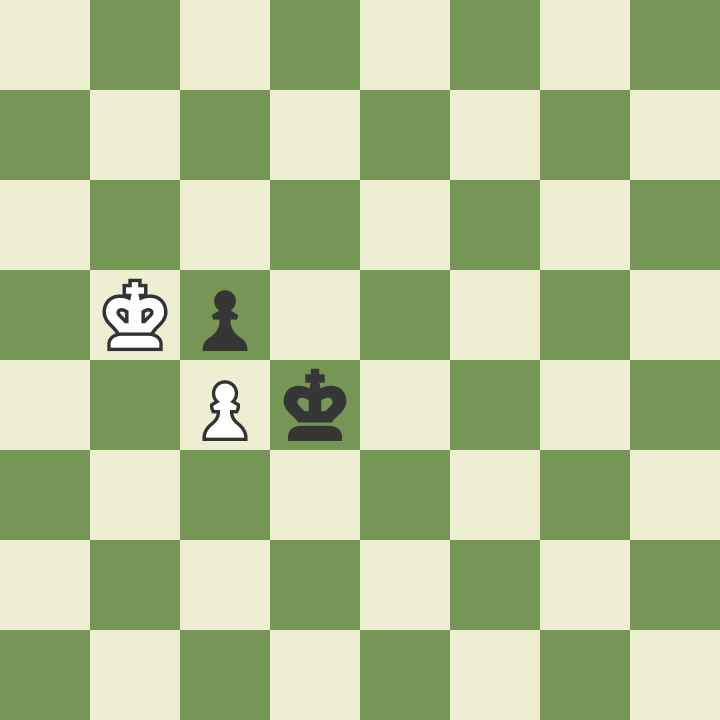
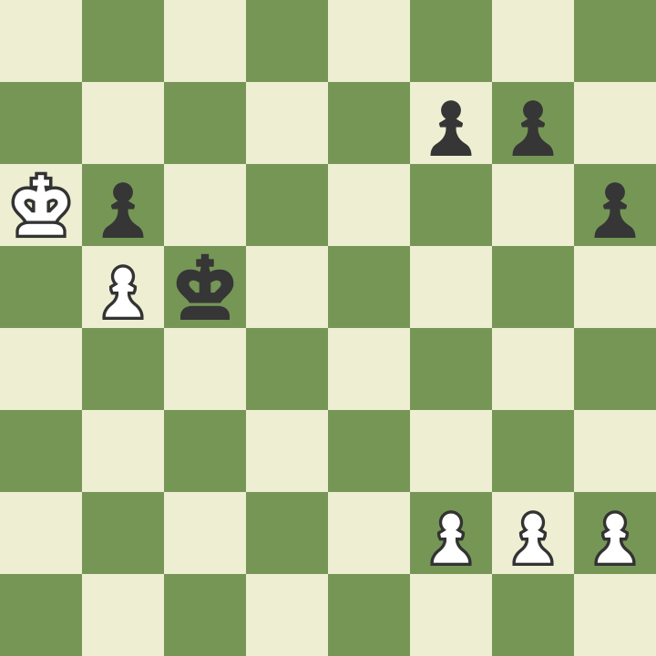

# Zugzwang: Don't Blink First

In chess, zugzwang (pronounced _Tsug-svang_), describes a situation where every legal move for a given player is unfavorable. Though this typically presents itself in the endgame, this can happen at any point in the course of play.

See the following board as an example:

Whichever King moves first will lose their pawn, and almost certainly the game. This becomes a situation to avoid, but also one to drive opponents towards if possible.

In a more baked-out example game (like the game below), whichever side can safely drag out their moves with the Queen-side pawns will eventually force zugzwang and gain the upper hand.

I hope this has been helpful, and that you can avoid (or intentionally cause) zugzwang when it arises.
