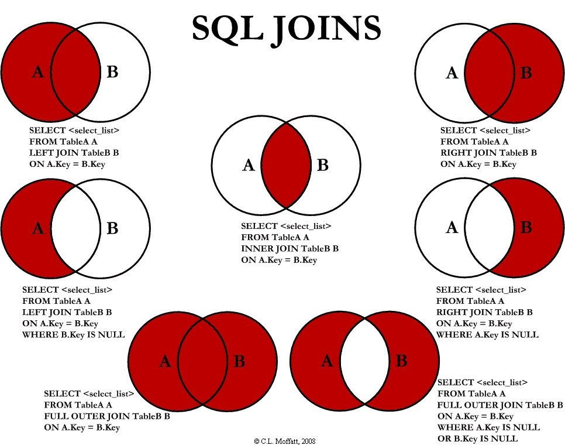

# Intro to Databases

## What (and Why) Are Databases?

Working with large datasets quickly and easily is a key skill in many industries. It never failed to surprise me in high budget, quick moving projects when a senior member of the team could not grasp that data wasn't just _there_. That we couldn't just _look at the data_ to find the answer.

In reality storing, accessing, cleaning, and maintaining large datasets is a field all unto itself. I am not an expert here, nor will I likely ever be. However, having a healthy respect for the role that data and databases play in web development is key.

Databases are specialized systems and storage containers for dealing with large (>1MM rows) sets of data. These aren't just really big Excel files; they leverage specialized query languages to index tables, retrieve necessary values, join them together, and return usable answers. While there are many flavors of databases, I'm going to cover the most obvious differentiator: SQL vs. NoSQL databases.

## SQL vs. NoSQL

## SQL Reference Reference

### Join Reference

